# VSH

<div align="center">


<br />

<b>AI 코드 생성 시대를 위한 데스크톱 중심 보안 분석 플랫폼</b>

<br />
<br />

[](#)
[](#)
[](#)
[](#)
[](#)

</div>

---

## Table of Contents

- [1. What is VSH?](#1-what-is-vsh)
- [2. Core Value](#2-core-value)
- [3. Architecture](#3-architecture)
- [4. Layer Design](#4-layer-design)
- [5. Key Features](#5-key-features)
- [6. Repository Structure](#6-repository-structure)
- [7. Quick Start](#7-quick-start)
- [8. Manual Run](#8-manual-run)
- [9. Desktop Demo Flow](#9-desktop-demo-flow)
- [10. API Reference](#10-api-reference)
- [11. Configuration](#11-configuration)
- [12. Semgrep, Syft, SonarQube](#12-semgrep-syft-sonarqube)
- [13. Runtime Data](#13-runtime-data)
- [14. Demo Target](#14-demo-target)
- [15. Troubleshooting](#15-troubleshooting)
- [16. Current Limitations](#16-current-limitations)
- [17. Roadmap](#17-roadmap)

---

## 1. What is VSH?

**VSH(Vibe Secure Hook)** 는 AI 코드 생성 시대에 맞춰 설계한 **Desktop-first Application Security Verification Platform**입니다.

VSH는 단순히 취약점을 찾는 데서 끝나지 않습니다. 빠른 정적 탐지 결과를 LLM reasoning, SBOM, SonarQube, annotation preview와 연결하여 사용자가 다음 질문까지 바로 확인할 수 있도록 설계되었습니다.

> “어디가 위험한가?”  
> “왜 위험한가?”  
> “실제로 공격 가능성이 있는가?”  
> “어떻게 고쳐야 하는가?”

```text
Select Project
   → L1 Static Detection
   → L2 Reasoning
   → L3 Verification
   → Desktop Dashboard
   → Fix / Annotation Preview
```

---

## 2. Core Value

| Value | Description |
|---|---|
| Desktop-first | CLI만 쓰는 도구가 아니라, Electron UI에서 프로젝트 선택부터 결과 확인까지 수행 |
| Explainable Security | 단순 탐지 메시지가 아니라 reasoning, attack scenario, fix suggestion 제공 |
| Hybrid L1 | 실제 Semgrep CLI와 내부 휴리스틱 탐지 계층을 함께 사용 |
| Expandable L3 | SonarQube, SBOM, PoC 검증 경로로 심화 가능 |
| Demo Friendly | Windows 로컬 환경에서 샘플 취약 프로젝트를 바로 스캔 가능 |
| Offline-friendly Baseline | API 키 없이도 mock reasoning으로 기본 시연 가능 |

### Security Portfolio Workflow

보안 저장소는 하나로 억지로 합치지 않고 각자의 분석 책임을 유지합니다. 대신 세 프로젝트가 `schema_version: "1.0"` 공통 Finding 계약을 출력하므로, 향후 하나의 대시보드나 리포트 수집기가 같은 방식으로 소비할 수 있습니다.

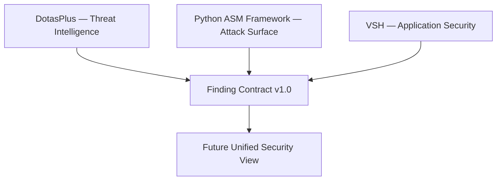

| Repository | 뚜렷한 역할 | 공통 출력 |
|---|---|---|
| `DotasPlus` | 외부 문서의 IOC를 자산과 연결하는 위협 인텔리전스 | `threat_intelligence.asset_indicator_match` |
| `python-asm-framework` | 승인된 범위의 자산·서비스·노출면 점검 | Attack Surface Finding |
| `VSH` | 소스코드와 의존성의 취약점 분석·설명·검증 | `application_security.code_finding`, `application_security.package_risk` |

VSH는 코드 취약점과 패키지 위험을 기존 상세 결과에 보존하면서, `findings.json`으로 공통 계약도 함께 내보냅니다. 이 연결은 저장소 간 직접 실행 의존성이 아니라 **결과 데이터의 상호운용성**을 위한 얇은 어댑터입니다.

---

## 3. Architecture

### 3.1 System Overview

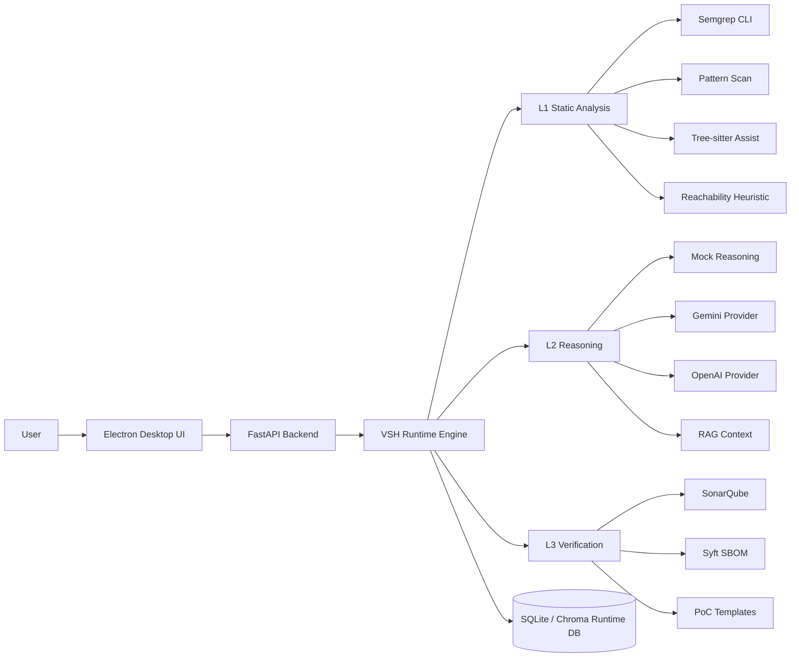

### 3.2 Data Flow

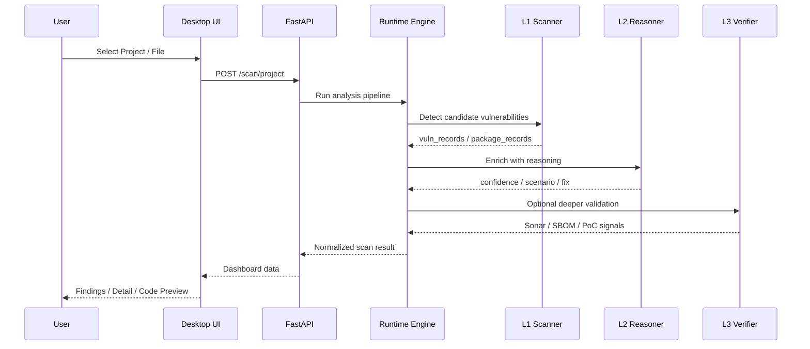

### 3.3 Layer Pipeline

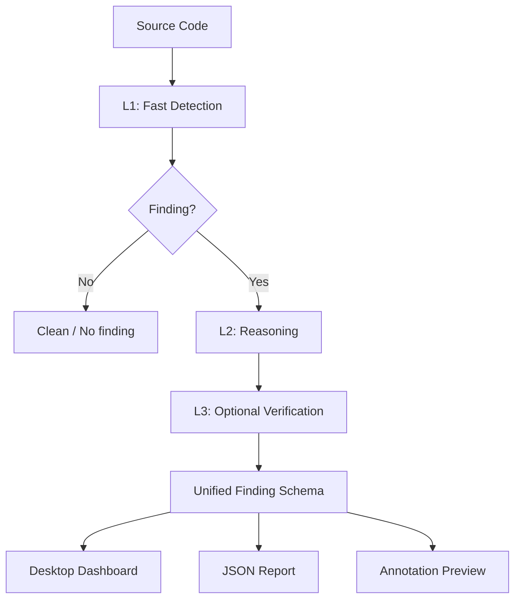

---

## 4. Layer Design

### L1. Static Analysis

L1은 빠르게 취약점 후보를 찾고, 후속 L2/L3가 이해할 수 있는 공통 스키마로 정규화합니다.

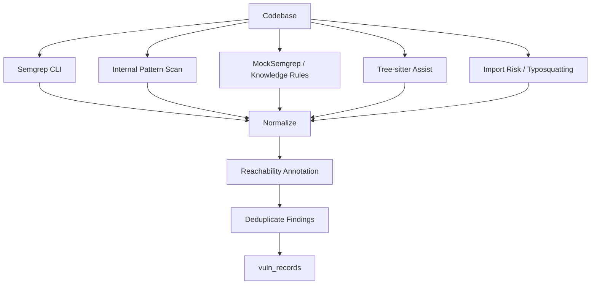

L1 구성 요소:

- 실제 `Semgrep CLI` 호출
- Semgrep 미설치 시 내부 휴리스틱 폴백
- `pattern_scan` 기반 빠른 규칙 탐지
- `TreeSitterScanner` 구조 보조
- `reachability` annotation
- `import_risk` 기반 typosquatting / 공급망 신호
- SBOM package record 생성 경로

### L2. Reasoning

L2는 L1의 탐지 결과를 사용자에게 설명 가능한 형태로 보강합니다.

| Field | Meaning |
|---|---|
| `reasoning` | 왜 위험한지 설명 |
| `attack_scenario` | 가능한 공격 흐름 |
| `fix_suggestion` | 수정 방향 |
| `confidence` | 파이프라인 신호 기반 신뢰도 |
| `provider` | mock / gemini / openai |

LLM API 키가 없어도 `mock` provider로 기본 데모가 가능합니다.

### L3. Verification

L3는 선택형 심화 검증 계층입니다.

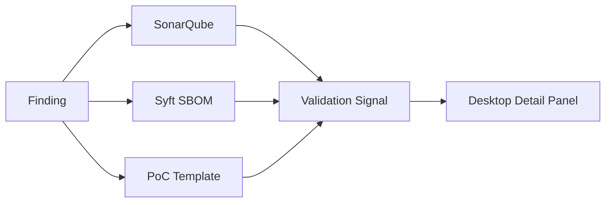

현재 L3는 다음 방향을 지원합니다.

- 로컬 SonarQube Docker 서버
- Syft 기반 SBOM
- CWE별 PoC template 확장 구조

---

## 5. Key Features

### Desktop UX

- 파일 / 프로젝트 선택
- `Scan File`, `Scan Project`
- Dashboard severity cards
- Findings table
- Detail panel
- Code preview
- `Annotate File`, `Annotate Project`
- 상세 JSON export와 공통 `findings.json` export
- Settings / system status

### Backend API

- scan / annotate / watch / settings / system status API 제공
- FastAPI 기반으로 Desktop과 분리
- 런타임 DB와 분석 엔진 연결

### Security Engine

- Semgrep CLI + 내부 휴리스틱 하이브리드 L1
- L2 reasoning provider 구조
- SBOM / Syft 연동
- SonarQube 기반 L3 확장
- Windows Docker wrapper 경로 지원

---

## 6. Repository Structure

```text
VSH/
├─ README.md
├─ QUICKSTART.md
├─ TROUBLESHOOTING.md
├─ run_vsh.bat
├─ run_vsh.ps1
├─ setup_and_run.ps1
├─ .env.example
└─ VSH_Project_MVP/
   ├─ requirements.txt
   ├─ config.py
   ├─ vsh_api/              # FastAPI entrypoint and routes
   ├─ vsh_desktop/          # Electron + React desktop UI
   ├─ vsh_runtime/          # Analysis orchestration engine
   ├─ layer1/               # Static analysis scanners
   ├─ layer2/               # Reasoning, RAG, provider layer
   ├─ l3/                   # Sonar, SBOM, PoC providers
   ├─ repository/           # SQLite / Chroma adapters
   ├─ shared/               # Runtime settings and common utilities
   ├─ scripts/              # Local SonarQube and setup helpers
   └─ tests/
      └─ fixtures/
         └─ vuln_project/   # Demo vulnerable project
```

---

## 7. Quick Start

> Windows 시연 기준으로는 OneDrive 경로보다 `C:\VSH` 같은 짧은 로컬 경로를 권장합니다.

```powershell
cd C:\VSH
.\run_vsh.bat
```

`run_vsh.bat` / `run_vsh.ps1`는 다음 작업을 목표로 합니다.

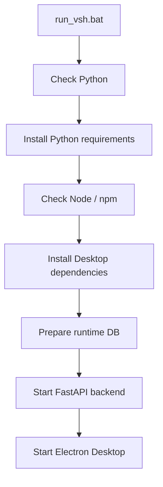

첫 실행은 의존성 설치 때문에 시간이 걸릴 수 있습니다. 발표나 시연 전에는 반드시 한 번 미리 실행해 두는 것을 권장합니다.

---

## 8. Manual Run

자동 실행이 실패하거나 디버깅이 필요한 경우 아래 방식으로 실행합니다.

### 8.1 Backend

```powershell
cd C:\VSH\VSH_Project_MVP
python -m pip install -r requirements.txt
python -m uvicorn vsh_api.main:app --host 127.0.0.1 --port 3000
```

정상 로그:

```text
Uvicorn running on http://127.0.0.1:3000
```

Health check:

```text
http://127.0.0.1:3000/health
```

### 8.2 CLI Finding Export

`--out-dir`를 지정하면 VSH 상세 결과와 함께 공통 Finding 계약 파일을 생성합니다.

```powershell
cd C:\VSH\VSH_Project_MVP
python -m scripts.vsh_cli scan-project tests\fixtures\vuln_project --out-dir exports
```

```text
exports/
├─ result.json
├─ result.md
├─ diagnostics.json
└─ findings.json
```

### 8.3 Desktop

새 PowerShell 창에서 실행합니다.

```powershell
cd C:\VSH\VSH_Project_MVP\vsh_desktop
npm install
npm run electron-dev
```

Vite dev server 확인:

```text
http://localhost:5173
```

---

## 9. Desktop Demo Flow

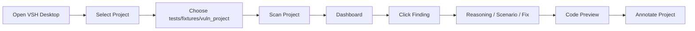

권장 시연 순서:

1. `run_vsh.bat` 실행
2. 앱이 빈 상태로 열림
3. `Select Project` 클릭
4. `VSH_Project_MVP\tests\fixtures\vuln_project` 선택
5. `Scan Project` 클릭
6. Dashboard severity card 확인
7. Findings 항목 클릭
8. Detail Panel에서 reasoning / attack scenario / fix suggestion 확인
9. Code Preview 확인
10. `Annotate Project`로 annotation preview 확인

---

## 10. API Reference

| Method | Endpoint | Description |
|---|---|---|
| GET | `/health` | Backend health check |
| GET | `/system/status` | Semgrep, Syft, Docker, L3 readiness |
| POST | `/scan/file` | Scan one file |
| POST | `/scan/project` | Scan project folder |
| POST | `/annotate/file` | Generate annotated preview for one file |
| POST | `/annotate/project` | Generate annotated preview for project |
| POST | `/watch/start` | Start backend watch |
| POST | `/watch/stop` | Stop backend watch |
| GET | `/watch/status` | Get watch status |
| GET | `/settings` | Read settings |
| POST | `/settings` | Save settings |
| POST | `/settings/test-llm` | Test LLM provider |
| POST | `/settings/check-semgrep` | Check Semgrep CLI |
| POST | `/settings/check-syft` | Check Syft CLI |

---

## 11. Configuration

`.env.example`를 복사해서 `.env`를 만들 수 있습니다.

```powershell
Copy-Item .env.example .env
```

주요 환경 변수:

| Variable | Description |
|---|---|
| `LLM_PROVIDER` | `mock`, `gemini`, `openai` 등 reasoning provider |
| `GEMINI_API_KEY` | Gemini provider 사용 시 필요 |
| `OPENAI_API_KEY` | OpenAI provider 사용 시 필요 |
| `SEMGREP_PATH` | Semgrep CLI 경로 override |
| `SYFT_PATH` | Syft CLI 경로 override |
| `SONAR_URL` / `SONARQUBE_URL` | SonarQube server URL |
| `SONAR_TOKEN` / `SONARQUBE_TOKEN` | Sonar auth token |
| `SONAR_PROJECT_KEY` | Sonar project key |
| `VSH_AUTO_START_API` | Desktop에서 API 자동 실행 여부 |
| `VSH_USE_DIST` | Electron에서 dist build 사용 여부 |

LLM 키가 없어도 기본 분석은 mock reasoning으로 동작합니다.

---

## 12. Semgrep, Syft, SonarQube

### Semgrep

VSH L1은 실제 Semgrep CLI와 내부 휴리스틱을 함께 사용합니다.

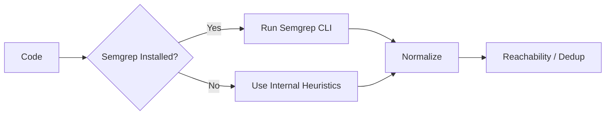

### Syft

Syft는 Python 라이브러리가 아니라 별도 CLI 도구입니다.

VSH는 다음을 지원합니다.

- PATH 자동 감지
- 수동 경로 override
- `/settings/check-syft`
- Docker wrapper 우회 실행

### Local SonarQube

SonarCloud 없이 로컬 SonarQube를 Docker로 띄울 수 있습니다.

```powershell
cd VSH_Project_MVP
python -m scripts.setup_local_sonarqube
```

자동 구성 항목:

1. `sonarqube:community` Docker image pull
2. `vsh-sonarqube` container 실행
3. `http://127.0.0.1:9000` 준비 대기
4. local Sonar token 생성
5. `vsh-local` project 생성
6. VSH settings에 URL / token / project key 저장

---

## 13. Runtime Data

VSH는 실행 안정성을 위해 레포 내부가 아닌 사용자 런타임 경로에 DB를 둡니다.

```text
C:\Users\<user>\.vsh\runtime_data
```

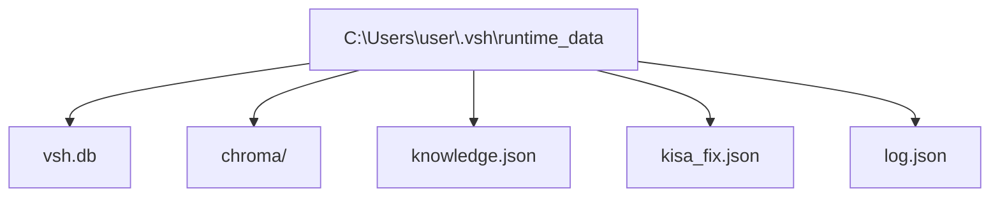

이 구조를 선택한 이유:

- Windows workspace / drive 조합에서 SQLite `disk I/O error` 방지
- Chroma persistent storage 안정화
- 레포 삭제/이동과 사용자 런타임 데이터 분리

별도로 `VshRuntimeEngine.write_outputs()` 또는 CLI의 `--out-dir`를 사용하면 다음 포트폴리오용 결과 묶음을 생성합니다.

| File | Purpose |
|---|---|
| `result.json` | VSH 고유의 전체 분석 결과 |
| `result.md` | 사람이 읽는 Markdown 리포트 |
| `diagnostics.json` | 에디터·UI 진단 데이터 |
| `findings.json` | DotasPlus·ASM과 호환되는 `schema_version: "1.0"` 공통 Finding |

---

## 14. Demo Target

기본 시연용 취약 프로젝트:

```text
VSH_Project_MVP\tests\fixtures\vuln_project
```

포함 취약 패턴 예시:

| File / Pattern | Risk |
|---|---|
| `cmd_injection.py` | Command Injection |
| `rce.py` | Eval / Code Execution |
| `sqli.py` | SQL Injection |
| `secret.py` | Hardcoded Secret |
| `path.py` | Path Traversal |

---

## 15. Troubleshooting

### 15.1 Electron 화면이 흰색으로만 보임

브라우저 DevTools Console을 확인합니다.

대표 원인:

```text
ReferenceError: process is not defined
```

해결 방향:

- React renderer에서 `process.env` 직접 참조 금지
- Vite 환경 변수는 `import.meta.env.VITE_*` 사용
- Electron 전용 API는 `window.electronAPI` 존재 여부 확인 후 호출

### 15.2 Uvicorn import 에러

잘못된 실행:

```powershell
cd VSH_Project_MVP\vsh_api
python -m uvicorn main:app
```

권장 실행:

```powershell
cd VSH_Project_MVP
python -m uvicorn vsh_api.main:app --host 127.0.0.1 --port 3000
```

### 15.3 OneDrive 경로에서 Electron 설치 실패

증상:

```text
EBUSY
EPERM
electron install.js failed
```

권장 경로:

```text
C:\VSH
```

### 15.4 L3가 비활성으로 보임

기본 스캔에는 영향이 없습니다. 심화 검증만 비활성화됩니다.

확인 항목:

- Docker 설치 여부
- Sonar token 설정 여부
- Sonar project key 설정 여부
- `/system/status` 응답

### 15.5 Watch를 켰는데 UI가 자동 갱신되지 않음

현재 구현 한계입니다.

- 백엔드 watch는 시작됨
- `.vsh/report.json`, `.vsh/diagnostics.json` 저장 가능
- 프런트 대시보드는 아직 자동 polling하지 않음

---

## 16. Current Limitations

| Area | Limitation |
|---|---|
| L1 | Semgrep 미설치 환경에서는 휴리스틱 / 정규식 비중이 큼 |
| Reachability | 완전한 taint analysis가 아니라 경량 추정 기반 |
| L2 | confidence는 LLM 고유 확률이 아니라 evidence / verification 신호 기반 heuristic |
| RAG | 한국어 보안 문서 검색 품질은 향후 hybrid retrieval로 개선 필요 |
| L3 | PoC template coverage가 아직 제한적 |
| Watch | backend watch 결과가 UI에 실시간 자동 반영되지는 않음 |
| Packaging | Windows / Electron 배포 패키징 안정화가 추가로 필요 |

---

## 17. Roadmap

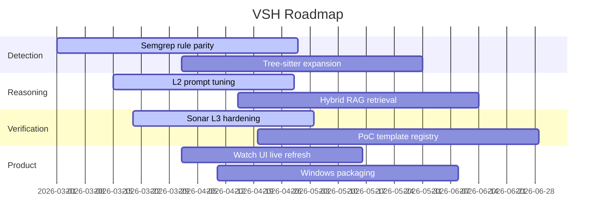

우선순위 높은 다음 단계:

- Watch 결과의 실시간 UI 반영
- Semgrep CLI와 내부 휴리스틱 rule parity 확장
- Tree-sitter 기반 구조 탐지 범위 확장
- L3 Sonar / PoC 실운영 연동 고도화
- Windows / Electron 배포 패키징 안정화
- 분석 이력 및 리포트 히스토리 관리
- VS Code extension diagnostics / quick fix 고도화

---

<div align="center">

### VSH

<b>From fast detection to explainable verification.</b>

빠른 정적 탐지, AI 기반 설명, SBOM/Sonar 심화 검증을 데스크톱 UX로 묶어  
개발자가 로컬에서 바로 실행하고 이해할 수 있는 보안 분석 플랫폼을 지향합니다.

</div>
